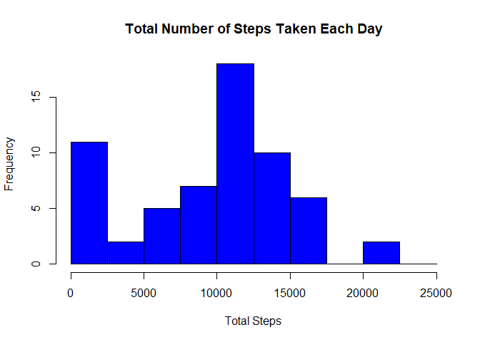
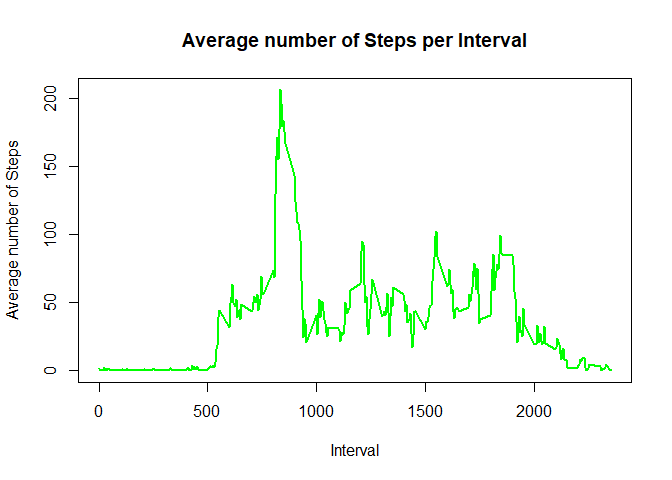

## Loading and preprocessing the data

```r
activity <- read.csv(unzip("activity.zip"))
activity$date <- as.Date(activity$date, "%Y-%m-%d")
summary(activity)
```

```
##      steps             date               interval     
##  Min.   :  0.00   Min.   :2012-10-01   Min.   :   0.0  
##  1st Qu.:  0.00   1st Qu.:2012-10-16   1st Qu.: 588.8  
##  Median :  0.00   Median :2012-10-31   Median :1177.5  
##  Mean   : 37.38   Mean   :2012-10-31   Mean   :1177.5  
##  3rd Qu.: 12.00   3rd Qu.:2012-11-15   3rd Qu.:1766.2  
##  Max.   :806.00   Max.   :2012-11-30   Max.   :2355.0  
##  NA's   :2304
```


## What is mean total number of steps taken per day?

```r
library(ggplot2)

daily_steps <- data.frame(with(activity, tapply(steps, date, sum, na.rm=TRUE)))
daily_steps$Date <- rownames(daily_steps)
names(daily_steps)[[1]] <- "Steps"
hist(daily_steps$Steps, xlab="Total Steps", col="blue", main="Total Number of Steps Taken Each Day", breaks=seq(0,25000, by=2500))
```

<!-- -->


```r
mean <- mean(daily_steps$Steps)
median <- median(daily_steps$Steps)
```
Mean of total number of steps taken per day: 9354.2295082  
Median of total number of steps taken per day: 10395


## What is the average daily activity pattern?

```r
average_interval_steps <- aggregate(activity$steps, by=list(activity$interval), FUN=mean, na.rm=TRUE)
names(average_interval_steps) <- c("Interval", "Mean")
with(average_interval_steps, plot(Interval, Mean, type="l", col="green", lwd=2,
                                    xlab="Interval",
                                    ylab="Average number of Steps",
                                    main="Average number of Steps per Interval"))
```

<!-- -->


```r
interval <- average_interval_steps[which.max(average_interval_steps$Mean), ]$Interval
```
The interval 835 has the maximum number of steps on average across all days. 


## Imputing missing values


## Are there differences in activity patterns between weekdays and weekends?
